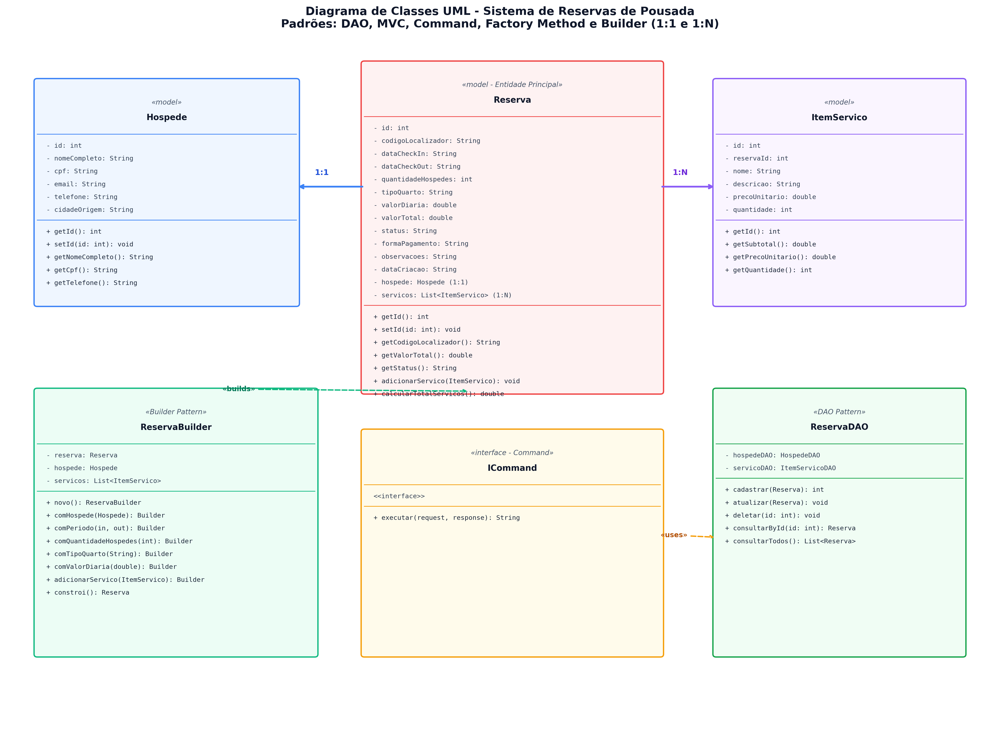
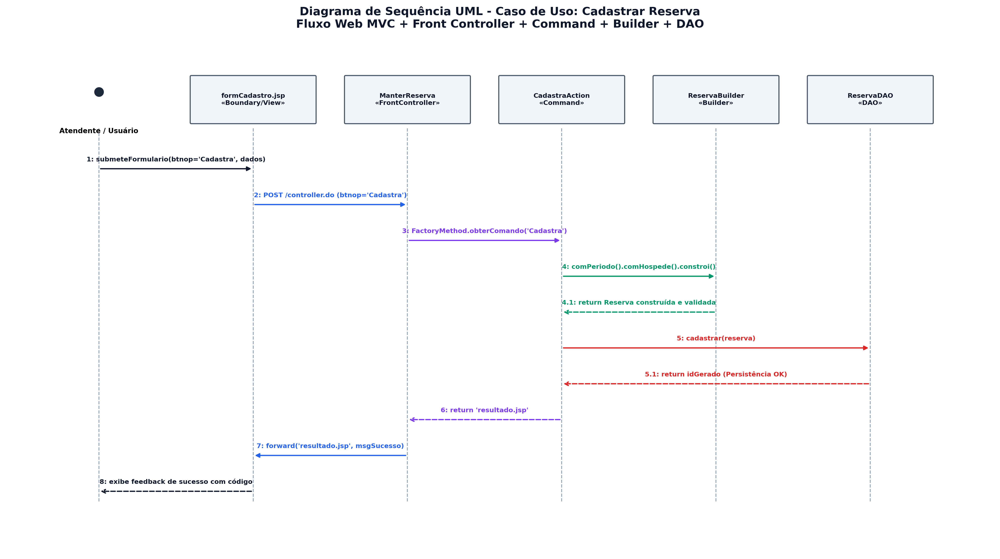

<div align="center">

# 🏨 Pousada Paradiso • Sistema de Gestão de Reservas

### ⚡ Plataforma Web Corporativa com Arquitetura Orientada a Objetos e Padrões de Projeto (GoF)

[](https://www.oracle.com/java/)
[](https://tomcat.apache.org/)
[](https://maven.apache.org/)
[](https://www.docker.com/)
[](https://railway.app/)
[](LICENSE)

<br/>


</div>

---

## 🌌 Visão Geral

Inspirado em plataformas de hospitalidade de alto padrão (*Airbnb*, *Booking*), o **Pousada Paradiso** é uma solução Web completa e robusta desenvolvida em **Java EE (JSP/Servlets)** para administração integral de reservas, hóspedes e experiências de hotelaria.

O ecossistema implementa regras de negócio avançadas de tarifação, automação de check-in inteligente e emissão de chaves digitais (*smart-lock PIN*), sustentado por uma arquitetura em camadas desacoplada e 5 padrões de projeto fundamentais.

```
       ┌────────────────────────────────────────────────────────┐
       │   🟣 MVC Front Controller  │  🟣 Command Pattern       │
       │   🟣 Factory Method        │  🟣 Builder Pattern       │
       │   🟣 DAO (JDBC / H2 / MySQL)                           │
       └────────────────────────────────────────────────────────┘
```

---

## 🔮 Destaques da Solução

- 🛎️ **Gestão Completa de Reservas (CRUD):** 11 atributos de domínio detalhados, controle de status em tempo real (`PENDENTE`, `CONFIRMADA`, `CANCELADA`) e cálculo dinâmico de diárias.
- 👤 **Hóspede Titular (1:1):** Cadastro completo, validação cadastral, credenciais de acesso e rastreamento de histórico.
- 🍹 **Itens de Serviços Adicionais (1:N):** Adição modular de serviços de lazer (Café Colonial na Cama, Transfer Privativo, Passeio de Barco, Spa com Pedras Quentes).
- ⚡ **Check-in Inteligente Automatizado:** Rotina de validação operacional que processa diárias, aplica taxas de preservação ambiental, descontos fidelidade *long-stay* e gera PIN de abertura para fechaduras inteligentes.
- 🛡️ **Banco Híbrido com Fallback Resiliente:** Conexão nativa com MySQL de produção e transição instantânea e transparente para banco embutido **H2** local sem necessidade de configuração prévia.

---

## 🧩 Padrões de Projeto (Design Patterns)

O projeto foi estruturado rigorosamente com base no padrão arquitetural **GoF (Gang of Four)**:

| Padrão | Classificação | Implementação no Projeto | Propósito Arquitetural |
| :--- | :--- | :--- | :--- |
| **DAO** *(Data Access Object)* | Estrutural / Persistência | `ReservaDAO`, `HospedeDAO`, `ItemServicoDAO`, `FabricaConexao` | Isola totalmente a lógica de negócios das queries SQL (`PreparedStatement`, `ResultSet`, transações ACID). |
| **MVC + Front Controller** | Arquitetural | Servlet central `controller.ManterReserva` mapeada para `/controller.do` | Ponto único de entrada para requisições HTTP, despachando para as Views JSP correspondentes. |
| **COMMAND** | Comportamental | Interface `ICommand` com classes dedicadas (`CadastraReservaAction`, `AtualizaReservaAction`, `DeletaReservaAction`, etc.) | Encapsula cada operação do sistema como um objeto independente, eliminando estruturas condicionais gigantescas (`if/else`, `switch`). |
| **FACTORY METHOD** | Criacional | `ServicoFactory` com subclasses (`CafeManhaFactory`, `TransferAeroportoFactory`, `PasseioBarcoFactory`, `SpaRelaxanteFactory`) | Delega a criação de instâncias de serviços específicos para subclasses concretas, garantindo extensibilidade aberta. |
| **BUILDER** | Criacional | `ReservaBuilder` com interface fluente (`with...()`, `constroi()`) | Garante a construção segura e atômica do objeto complexo `Reserva`, com validação prévia de integridade e imutabilidade. |

---

## 📐 Modelagem e Diagramas UML

Os diagramas representam a arquitetura estrutural e o fluxo dinâmico de comandos da aplicação:

### 🟣 1. Diagrama de Classes
Contempla o relacionamento entre o Front Controller, a interface `ICommand`, as Actions, Factories, Builders, DAOs e Entidades de Domínio.

<div align="center">
  
</div>

<br/>

### 🟣 2. Diagrama de Sequência
Exemplifica o ciclo de vida completo de uma requisição Web: desde a submissão no formulário JSP, passando pelo `ManterReserva`, invocação reflexiva do `Command`, persistência via `DAO` até a renderização do feedback.

<div align="center">
  
</div>

---

## 🚀 Como Executar o Projeto

Você pode executar a aplicação de **duas formas**: com Docker ou diretamente com Java/Maven.

### Opção A: Execução Imediata via Maven (Recomendada para Desenvolvimento)

O projeto já conta com o **Apache Tomcat 9 Embutido** e banco **H2**, não exigindo nenhum software além do JDK 17 e Maven:

```bash
# 1. Clone o repositório
git clone https://github.com/Marcolopes-malp/Pousa-Patterns.git
cd Pousa-Patterns

# 2. Compile e inicie o servidor instantaneamente
mvn compile exec:java
```

👉 **Acesse no navegador:** [http://localhost:8080/controller.do](http://localhost:8080/controller.do)

---

### Opção B: Execução via Docker (Ambiente Isolado e Produção)

Graças ao *multi-stage build* configurado no `Dockerfile`, o código é compilado com Maven e servido no container oficial do Tomcat 9:

```bash
# 1. Construir a imagem Docker
docker build -t pousada-reservas .

# 2. Executar o container na porta 8080
docker run -p 8080:8080 --name pousada pousada-reservas
```

👉 **Acesse no navegador:** [http://localhost:8080/controller.do](http://localhost:8080/controller.do)

---

### Opção C: Deploy na Nuvem (Railway / Render)

O projeto é 100% compatível com a plataforma **Railway**:

1. Acesse o painel da [Railway](https://railway.app/).
2. Clique em **New Project** > **Deploy from GitHub repo**.
3. Selecione o repositório `Marcolopes-malp/Pousa-Patterns`.
4. A Railway detectará o `Dockerfile` e realizará o deploy em instantes, disponibilizando uma URL pública com HTTPS.

---

## 🗂️ Estrutura do Projeto

```text
pousada-reservas/
├── 🐳 Dockerfile                         # Multi-stage build (Maven + Tomcat 9)
├── 📦 pom.xml                            # Configurações de dependências Maven
├── 🖼️ diagrama_classes_uml.png           # Diagrama estrutural de classes
├── 🖼️ diagrama_sequencia_uml.png         # Diagrama comportamental de sequência
├── 📄 README.md                          # Documentação técnica do projeto
└── 📁 src/
    └── 📁 main/
        ├── 📁 java/                      # Código-fonte Java 17
        │   ├── 📁 controller/            # Front Controller e Ações (Command Pattern)
        │   ├── 📁 dao/                   # Camada de Persistência JDBC (DAO Pattern)
        │   ├── 📁 model/                 # Entidades, Builders e Factories (GoF)
        │   └── 📁 util/                  # Servidor Tomcat Embutido e Conexão H2/MySQL
        └── 📁 webapp/                    # Interface Visual Web
            ├── 📁 css/                   # Folhas de estilo modernas e responsivas
            ├── 📁 WEB-INF/               # web.xml e configurações do servlet container
            └── 📄 *.jsp                  # Páginas dinâmicas (Index, Reservas, Admin)
```

---

## 🎓 Informações Acadêmicas

- **Instituição:** Universidade de Mogi das Cruzes (UMC)
- **Curso:** Bacharelado em Engenharia de Software (5º Semestre)
- **Disciplina:** Padrões de Projeto (PP) - Avaliação M1
- **Aluno:** Marco Antonio Lopes Pedro *(Grupo G14)*
- **Corpo Docente:** Prof. Me. Wolley W. Silva & Profa. Dra. Danielle Martin

---

<div align="center">


<sub>Desenvolvido com 💜 por <b>Marco Antonio Lopes Pedro</b> • Engenharia de Software UMC</sub>

</div>
