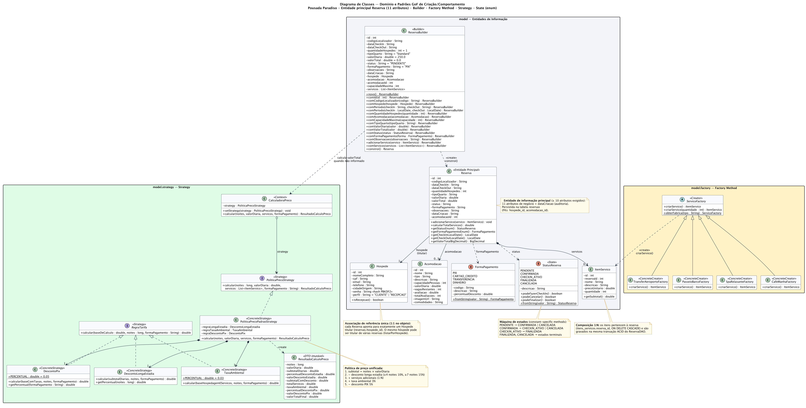
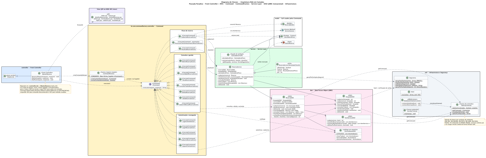
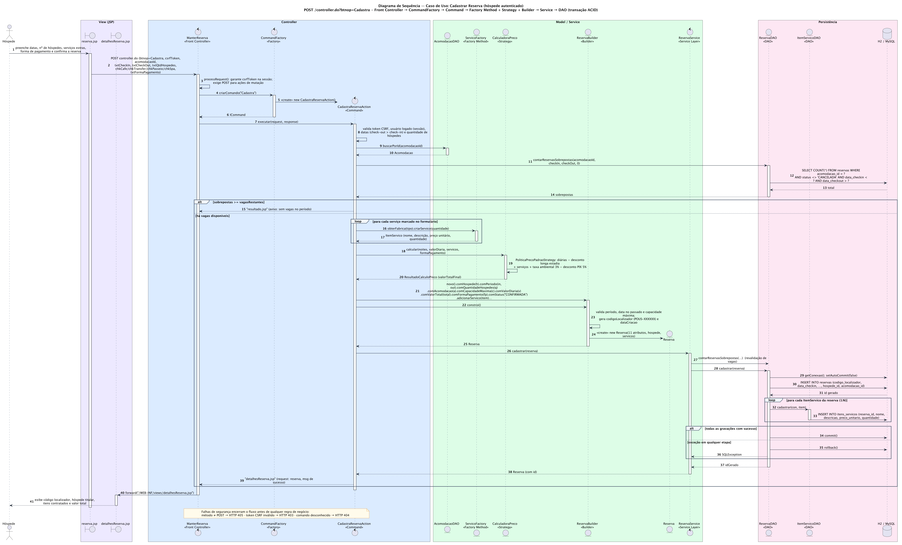
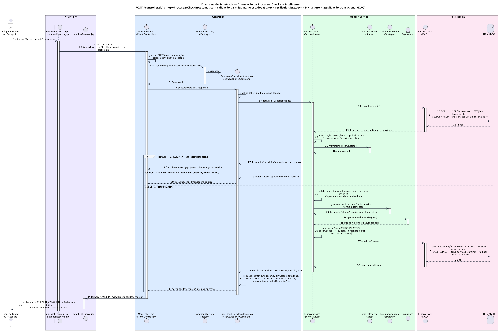

<div align="center">

# 🏨 Pousada Paradiso • Sistema de Gestão de Reservas

### ⚡ Plataforma Web com Padrões de Projeto (GoF), Arquitetura em Camadas e Segurança Defensiva

[](https://www.oracle.com/java/)
[](https://tomcat.apache.org/)
[](https://maven.apache.org/)
[](https://www.docker.com/)
[](LICENSE)

<br/>


</div>

> 📚 **Material de Apresentação:** Consulte o [GUIA_APRESENTACAO.md](GUIA_APRESENTACAO.md) para o roteiro completo de apresentação para a banca acadêmica, resumo dos padrões GoF, scripts de explicação e FAQ de defesa.

---

## 🌌 Visão Geral

Inspirado em plataformas de hospitalidade de alto padrão (*Airbnb*, *Booking*), o **Pousada Paradiso** é uma solução Web desenvolvida em **Java EE (JSP/Servlets 4)** para administração integral de reservas, acomodações, hóspedes e experiências de hotelaria.

O ecossistema implementa regras de negócio para tarifação dinâmica, controle de disponibilidade de quartos, ciclo de vida de check-in automatizado e emissão de chaves digitais (*smart-lock PIN*), sustentado por uma arquitetura em camadas desacoplada e padrões de projeto GoF e arquiteturais.

```
       ┌────────────────────────────────────────────────────────┐
       │   🟣 Padrões GoF: Command, Factory Method, Builder,   │
       │                   Strategy, State                      │
       │   🟣 Arquitetura: MVC + Front Controller, Service, DAO │
       │   🟣 Persistência: JDBC Transacional ACID (H2 / MySQL) │
       │   🟣 Segurança: PBKDF2 (Salt), CSRF, XSS, SecureRandom │
       └────────────────────────────────────────────────────────┘
```

---

## 🔮 Destaques da Solução

- 🛎️ **Gestão Completa de Reservas (CRUD + automação):** entidade `Reserva` com 11 atributos de domínio, operações de inserir, atualizar, excluir, consultar por id e consultar todos, controle de status (`PENDENTE`, `CONFIRMADA`, `CHECKIN_ATIVO`, `FINALIZADA`, `CANCELADA`) e cálculo dinâmico de diárias.
- 👤 **Hóspede Titular (associação 1:1 por referência):** cada `Reserva` referencia exatamente um `Hospede` titular (`reservas.hospede_id`), com cadastro completo, credenciais com hash PBKDF2 + salt e perfis `CLIENTE` / `RECEPCAO`.
- 🍹 **Itens de Serviços Adicionais (composição 1:N):** serviços criados por Factory Method (Café da Manhã Colonial, Transfer Executivo, Passeio de Escuna e Massagem Terapêutica) e persistidos atomicamente com a reserva.
- ⚡ **Check-in Inteligente Automatizado:** rotina de validação operacional com máquina de estados que impede check-ins repetidos ou em reservas canceladas/finalizadas, valida a janela temporal e gera PIN seguro via `SecureRandom`.
- 🛡️ **Banco de Dados Transacional e Resiliente:** transações ACID com commit/rollback em conexão única, eliminação de N+1 queries via `JOIN` e carga em lote, e suporte a H2 embutido ou MySQL configurado por variáveis de ambiente.

---

## 🧩 Padrões de Projeto (Design Patterns)

O projeto separa claramente os padrões de projeto **GoF (Gang of Four)** dos padrões arquiteturais e de persistência:

### Padrões GoF Implementados

| Padrão | Tipo GoF | Implementação no Projeto | Propósito |
| :--- | :--- | :--- | :--- |
| **Command** | Comportamental | Interface `ICommand` e 16 comandos concretos (`CadastraReservaAction`, `AtualizaReservaAction`, `DeletaReservaAction`, `ProcessarCheckInAutomaticoReservaAction`, etc.), obtidos pelo registro tipado `CommandFactory` | Encapsula cada requisição como um objeto autônomo, desacoplando o Front Controller das operações específicas. |
| **Factory Method** | Criacional | `ServicoFactory` (criador abstrato com `criarServico()`) e criadores concretos `CafeManhaFactory`, `TransferAeroportoFactory`, `PasseioBarcoFactory`, `SpaRelaxanteFactory` | Delega a instanciação de cada `ItemServico` para subclasses especialistas, sem acoplar o comando de cadastro aos produtos concretos. |
| **Builder** | Criacional | `ReservaBuilder` com interface fluente (`novo()`, `com...()`, `constroi()`) | Garante a construção segura e validada do objeto complexo `Reserva`, conferindo regras defensivas de período, data no passado e capacidade da acomodação. |
| **Strategy** | Comportamental | Interface `PoliticaPrecoStrategy`, estratégia concreta `PoliticaPrecoPadraoStrategy` e contexto `CalculadoraPreco`; regras `RegraTarifa` (`DescontoLongaEstadia`, `TaxaAmbiental`, `DescontoPix`). `service.CalculadoraTarifa` é apenas a fachada de tarifação | Permite a aplicação dinâmica e extensível de políticas de descontos e taxas sem alterar quem calcula o preço. |
| **State** | Comportamental | `StatusReserva` (enum com métodos específicos por constante: `podeFazerCheckIn()`, `podeCancelar()`, `podeFinalizar()`) | Modela o ciclo de vida formal da reserva (`PENDENTE` ➔ `CONFIRMADA` ➔ `CHECKIN_ATIVO` ➔ `FINALIZADA`), rejeitando transições ilegais no check-in. |

### Padrões Arquiteturais e Estruturais

| Padrão | Tipo | Implementação | Propósito |
| :--- | :--- | :--- | :--- |
| **Front Controller + MVC** | Arquitetural | `controller.ManterReserva` mapeado em `/controller.do` (e no alias `/ManterReserva`) | Ponto único de entrada para todas as requisições HTTP: gera o token CSRF, exige POST em ações de mutação, aplica o controle de acesso da recepção e despacha para as Views JSP protegidas em `WEB-INF/views/`. |
| **Registro de Comandos (Simple Factory)** | Criacional / Infra | `br.com.commandfactory.controller.CommandFactory` (`Map<String, Supplier<ICommand>>`) | Mapeamento explícito e tipado entre o parâmetro `btnop` e o comando, sem reflexão; comando desconhecido resulta em HTTP 404. |
| **Service Layer** | Arquitetural | `service.ReservaService` (cadastro com validação de vagas, check-in e atualização) | Centraliza as regras de negócio da pousada, isolando os Controllers da camada de dados. |
| **DAO (Data Access Object)** | Persistência | `ReservaDAO`, `HospedeDAO`, `ItemServicoDAO` (JDBC) e `AcomodacaoDAO` (catálogo em memória) | Encapsula o acesso aos dados; `ReservaDAO` executa transações ACID (`setAutoCommit(false)`, `commit`, `rollback`) e elimina consultas N+1. |
| **Factory (Conexão)** | Criacional / Infra | `util.FabricaConexao` | Centraliza a obtenção de conexões JDBC com inicialização thread-safe e execução automática de `schema.sql` e das cargas iniciais. |

---

## 🔒 Arquitetura de Segurança (OWASP)

A aplicação conta com uma camada de segurança robusta implementada em `util.Seguranca` e no Front Controller:

- 🔑 **Hashing de Senhas (PBKDF2):** Utiliza `PBKDF2WithHmacSHA256` com Salt de 16 bytes e 10.000 iterações. Senhas nunca são persistidas em texto plano.
- ⏱️ **Mitigação de Timing Attacks:** Validação de credenciais e tokens em tempo constante utilizando `MessageDigest.isEqual`.
- 🛡️ **Proteção CSRF:** Token de sincronização gerado na sessão e validado nas operações que alteram dados (cadastro e atualização de reserva, exclusão, check-in e logout). Ações de mutação só são aceitas via POST (HTTP 405 caso contrário).
- 🚫 **Prevenção de XSS:** As saídas de dados vindos do usuário ou do banco nas páginas JSP passam pelo método `util.Html.esc()`, impedindo injeção de scripts maliciosos.
- 🧭 **Sanitização de Open Redirect:** Bloqueio de redirecionamentos externos e ataques de *CRLF Injection*, aceitando apenas rotas internas do Front Controller.
- 🔐 **Sessão e PIN Seguros:** Rotação do ID de sessão no login (mitigação de *session fixation*) e códigos de acesso digital gerados por `java.security.SecureRandom`.
- 🗂️ **Views Protegidas:** Os JSPs ficam em `WEB-INF/views/`, inacessíveis por URL direta (HTTP 404), forçando a passagem pelo Front Controller.

---

## 👥 Contas de Demonstração (Seed)

Para facilitar testes e avaliação da banca examinadora, a aplicação inicializa automaticamente com os seguintes usuários:

| Perfil | E-mail | Senha | Permissões |
| :--- | :--- | :--- | :--- |
| **Recepção** | `recepcao@pousada.com.br` | `admin123` | Acesso ao Painel Administrativo, edição/exclusão de reservas, cadastro manual |
| **Hóspede** | `marco.pedro@pousada.com.br` | `123456` | Acesso a "Minhas Reservas", check-in automático de suas estadias |
| **Hóspede** | `mariana.ramos@email.com` | `123456` | Consulta e visualização de reservas do usuário |
| **Hóspede** | `lucas.prado@email.com` | `123456` | Consulta e visualização de reservas do usuário |

A carga inicial também cria 4 acomodações e 3 reservas de exemplo (`POUS-2026-X01` a `X03`) com serviços adicionais vinculados.

---

## ⚙️ Variáveis de Ambiente

A aplicação segue os princípios do *12-Factor App* e pode ser configurada via variáveis de ambiente:

| Variável | Padrão | Descrição |
| :--- | :--- | :--- |
| `PORT` | `8080` | Porta do servidor HTTP (Tomcat embutido) |
| `DB_ENGINE` | `h2` | Motor de banco de dados (`h2` ou `mysql`) |
| `DB_URL` | *(calculado)* | String JDBC completa (ex: `jdbc:mysql://localhost:3306/pousada_db`) |
| `DB_USER` | `sa` (H2) / `root` (MySQL) | Usuário do banco de dados |
| `DB_PASS` | `""` | Senha do banco de dados |
| `DB_PATH` | `./pousada_db` | Caminho do arquivo de dados do H2 local |

---

## 🔗 Especificação de Endpoints (Front Controller)

Todas as requisições passam por `controller.do` (ou `/ManterReserva`). A ação é lida do parâmetro `btnop` (também aceitos `acao` e `action`); sem ação, executa `ConsultaTodos`. Regras gerais:

- Ações de mutação (`Cadastra`, `Atualiza`, `Deleta`, `ProcessarCheckInAutomatico`, `LoginCliente`, `CadastraCliente`, `LogoutCliente`) só aceitam **POST** → `405 Method Not Allowed` em GET.
- Ações da recepção (`Admin`, `CadastroManual`, `Edita`, `Atualiza`, `Deleta`) exigem sessão com perfil `RECEPCAO`; sem login → `302` para `Login` preservando o `redirect` interno; com perfil errado → `resultado.jsp` com mensagem de acesso negado.
- Comando desconhecido → `404 Not Found`. Acesso direto a `/WEB-INF/views/*.jsp` → `404`.
- O token CSRF fica na sessão (`csrfToken`) e é enviado pelos formulários como campo oculto de mesmo nome.

| Ação (`btnop`) | Método | Acesso | CSRF | Command | Resposta |
| :--- | :---: | :--- | :---: | :--- | :--- |
| `ConsultaTodos` *(padrão)* | GET | Público | – | `ConsultaTodosReservaAction` | `index.jsp` — catálogo de acomodações |
| `NovaReserva` | GET | Público | – | `NovaReservaAction` | `reserva.jsp` — formulário da acomodação `acomodacaoId` (aceita `txtCheckIn`, `txtCheckOut`, `txtQtdHospedes` pré-preenchidos) |
| `Cadastra` | POST | Público (cria a conta do hóspede quando não há sessão) | ✔ | `CadastraReservaAction` | `detalhesReserva.jsp` com a reserva confirmada; `resultado.jsp` em caso de erro ou falta de vagas |
| `ConsultaById` | GET | Autenticado (titular ou recepção) | – | `ConsultaByIdReservaAction` | `detalhesReserva.jsp` da reserva `id` |
| `ProcessarCheckInAutomatico` | POST | Autenticado (titular ou recepção) | ✔ | `ProcessarCheckInAutomaticoReservaAction` | `detalhesReserva.jsp` com status `CHECKIN_ATIVO`, PIN e resumo financeiro |
| `MinhasReservas` | GET | Autenticado | – | `MinhasReservasAction` | `minhasReservas.jsp` |
| `Login` | GET | Público | – | `LoginReservaAction` | `login.jsp` |
| `LoginCliente` | POST | Público | –¹ | `LoginClienteAction` | Redirect para `Admin` (recepção), `MinhasReservas` (hóspede) ou `redirect` interno validado |
| `LogoutCliente` | POST | Autenticado | ✔ | `LogoutClienteAction` | Invalida a sessão e redireciona para `ConsultaTodos` |
| `Cadastro` | GET | Público | – | `CadastroReservaAction` | `cadastro.jsp` |
| `CadastraCliente` | POST | Público | –¹ | `CadastraClienteAction` | Cria o hóspede, inicia a sessão e redireciona para `MinhasReservas` |
| `Admin` | GET | `RECEPCAO` | – | `AdminReservaAction` | `admin.jsp` — todas as reservas |
| `CadastroManual` | GET | `RECEPCAO` | – | `CadastroManualReservaAction` | `formCadastro.jsp` |
| `Edita` | GET | `RECEPCAO` | – | `EditaReservaAction` | `formEditar.jsp` da reserva `id` |
| `Atualiza` | POST | `RECEPCAO` | ✔ | `AtualizaReservaAction` | `resultado.jsp` com confirmação |
| `Deleta` | POST | `RECEPCAO` | ✔ | `DeletaReservaAction` | `resultado.jsp` com confirmação |

<sub>¹ Os formulários de login e de cadastro de conta enviam o token, mas essas duas ações ainda não o validam (melhoria futura).</sub>

---

## 📐 Modelagem e Diagramas UML

Os diagramas são gerados a partir das fontes **PlantUML** em [`docs/uml/`](docs/uml/) e refletem o código atual. Para regenerar (Java 17+; o `plantuml.jar` é baixado automaticamente, sem necessidade de Graphviz):

```bash
python3 docs/uml/gerar_diagramas.py
```

Cada diagrama possui versão PNG (exibida abaixo) e SVG vetorial para zoom sem perda.

### 🟣 1. Diagrama de Classes — Domínio e Padrões GoF

Entidade principal `Reserva` (11 atributos), `Hospede`, `ItemServico`, `Acomodacao`, os enums `StatusReserva` (State) e `FormaPagamento`, o `ReservaBuilder` (Builder), a hierarquia `ServicoFactory` (Factory Method) e a família `PoliticaPrecoStrategy` / `RegraTarifa` (Strategy).

Relacionamentos: `Reserva → Hospede` (referência única ao titular, FK `hospede_id`; o mesmo hóspede pode ser titular de várias reservas, listadas em "Minhas Reservas"), `Reserva ◆→ ItemServico` (composição 1:N, FK `reserva_id` com `ON DELETE CASCADE`) e `Reserva → Acomodacao` (0..1).

<div align="center">
  
  <sub><a href="docs/uml/diagrama_classes_dominio_uml.svg">abrir SVG</a> · <a href="docs/uml/diagrama_classes_dominio_uml.puml">fonte .puml</a></sub>
</div>

<br/>

### 🟣 2. Diagrama de Classes — Arquitetura Web em Camadas

View (JSP) → `ManterReserva` (Front Controller) → `CommandFactory` / `ICommand` e os 16 comandos concretos → `ReservaService` → DAOs (`ReservaDAO`, `HospedeDAO`, `ItemServicoDAO`, `AcomodacaoDAO`) → `FabricaConexao`, `Seguranca`, `Html` e o `ServidorTomcat` embutido.

<div align="center">
  
  <sub><a href="docs/uml/diagrama_classes_arquitetura_uml.svg">abrir SVG</a> · <a href="docs/uml/diagrama_classes_arquitetura_uml.puml">fonte .puml</a></sub>
</div>

<br/>

### 🟣 3. Diagrama de Sequência — Cadastrar Reserva

Ciclo de vida completo de uma requisição Web: submissão em `reserva.jsp`, despacho no Front Controller, criação do comando pela `CommandFactory`, validações, criação dos serviços via Factory Method, cálculo do total via Strategy, construção da `Reserva` com o Builder, chamada ao `ReservaService` e persistência transacional no `ReservaDAO` (com `commit`/`rollback`), terminando no `forward` para `detalhesReserva.jsp`.

<div align="center">
  
  <sub><a href="docs/uml/diagrama_sequencia_uml.svg">abrir SVG</a> · <a href="docs/uml/diagrama_sequencia_uml.puml">fonte .puml</a></sub>
</div>

<br/>

### 🟣 4. Diagrama de Sequência — Check-in Inteligente (automação de processo)

Fluxo do requisito de automação: validação de POST/CSRF/sessão, `ReservaService.checkIn()`, consulta com `JOIN`, autorização (titular ou recepção), verificação da máquina de estados (`StatusReserva`), janela temporal, recálculo financeiro (Strategy), geração do PIN com `SecureRandom` e atualização transacional, com os fluxos alternativos de idempotência e de recusa.

<div align="center">
  
  <sub><a href="docs/uml/diagrama_sequencia_checkin_uml.svg">abrir SVG</a> · <a href="docs/uml/diagrama_sequencia_checkin_uml.puml">fonte .puml</a></sub>
</div>

---

## 🚀 Como Executar o Projeto

### Opção A: Execução Imediata via Maven (Recomendada)

O projeto conta com o **Apache Tomcat 9 Embutido** e banco embutido **H2**, não exigindo nada além do JDK 17+ e Maven 3.9+ (compila com `--release 17`, logo funciona também em JDKs mais novos):

```bash
# 1. Clone o repositório
git clone https://github.com/Marcolopes-malp/Pousa-Patterns.git
cd Pousa-Patterns

# 2. Compile e inicie o servidor (execute a partir da raiz do projeto, onde está o pom.xml)
mvn compile exec:java

# Opcional: outra porta
PORT=9090 mvn compile exec:java
```

👉 **Acesse no navegador:** [http://localhost:8080/controller.do](http://localhost:8080/controller.do)

O banco H2 é criado automaticamente em `./pousada_db.mv.db` (ignorado pelo Git) com o schema e as contas de demonstração.

---

### Opção B: Execução via Docker (Ambiente Isolado)

Graças ao *multi-stage build* otimizado com cache no `Dockerfile`, o código é compilado com Maven e servido no container oficial do Tomcat 9 com usuário não-root:

```bash
# 1. Construir a imagem Docker
docker build -t pousada-reservas .

# 2. Executar o container na porta 8080 (dados do H2 persistidos no volume /app/data)
docker run -p 8080:8080 --name pousada pousada-reservas
```

👉 **Acesse no navegador:** [http://localhost:8080/controller.do](http://localhost:8080/controller.do)

---

## 🧪 Suíte de Testes Automatizados (42 Testes)

O projeto conta com uma suíte de testes unitários e de integração cobrindo regras de negócio, Builder, Factory Method, Strategy, State, integridade ACID e controle de concorrência:

```bash
mvn test
# Tests run: 42, Failures: 0, Errors: 0, Skipped: 0
```

| Classe de Teste | Quantidade | Escopo Validado |
| :--- | :--- | :--- |
| `CalculadoraTarifaTest` | 8 testes | Padrão Strategy: diárias, descontos longa estadia, PIX e taxa ambiental |
| `ReservaBuilderTest` | 6 testes | Padrão Builder: validações defensivas de datas, períodos e capacidades |
| `StatusReservaTest` | 4 testes | Padrão State: máquina de estados e validações de transição de check-in |
| `ServicoFactoryTest` | 4 testes | Padrão Factory Method: criação de itens de serviços adicionais (1:N) |
| `CommandFactoryTest` | 4 testes | Padrão Command: registro de ações tipadas e resposta HTTP 404 |
| `AcomodacaoDisponibilidadeTest` | 4 testes | Regra de negócio: detecção de reservas sobrepostas e conflito de vagas |
| `ReservaDAOPersistenciaTest` | 3 testes | Padrão DAO: transações ACID, integridade 1:N e comprovação de Rollback |
| `HospedeReservaDesacoplamentoTest`| 2 testes | Integridade: separação da edição de hóspede da edição de reserva |
| `AcomodacaoDAOTest` | 2 testes | Consulta de acomodações e busca por identificador |
| `ReservaServiceTest` | 2 testes | Camada de serviço: orquestração de reservas e validação de check-in |
| `FormaPagamentoTest` | 2 testes | Tipagem forte: conversões e validação do enum de formas de pagamento |
| `RedirectPreservacaoTest` | 1 teste | Segurança: preservação de parâmetros com URLEncoder |

---

## 🗂️ Estrutura do Projeto

```text
pousada-reservas/
├── 🐳 Dockerfile                         # Multi-stage build otimizado com cache (Tomcat 9.0.98)
├── 🐳 .dockerignore                      # Arquivos ignorados pelo build Docker
├── 📦 pom.xml                            # Configurações do Maven (JDK 17 release, escopos provided)
├── 📄 LICENSE                            # Licença MIT
├── 📄 GUIA_APRESENTACAO.md / .docx       # Guia mestre de apresentação acadêmica e defesa M1
├── 📄 README.md                          # Documentação técnica do projeto
├── 📁 docs/uml/                          # Diagramas UML (fontes PlantUML + PNG/SVG gerados)
│   ├── 🖼️ diagrama_classes_dominio_uml.*      # Classes: domínio, Builder, Factory Method, Strategy, State
│   ├── 🖼️ diagrama_classes_arquitetura_uml.*  # Classes: Front Controller, Command, Service, DAO, util
│   ├── 🖼️ diagrama_sequencia_uml.*            # Sequência: Cadastrar Reserva
│   ├── 🖼️ diagrama_sequencia_checkin_uml.*    # Sequência: Check-in Inteligente
│   └── 🐍 gerar_diagramas.py                  # Renderiza os .puml em PNG e SVG (PlantUML)
└── 📁 src/
    ├── 📁 main/
    │   ├── 📁 java/                      # Código-fonte Java 17
    │   │   ├── 📁 br/com/commandfactory/controller/ # Commands (ICommand, 16 Actions e CommandFactory)
    │   │   ├── 📁 controller/            # Front Controller (ManterReserva)
    │   │   ├── 📁 dao/                   # Persistência JDBC com transações ACID (ReservaDAO, etc.)
    │   │   ├── 📁 model/                 # Entidades, Enums (State), Builder, Factory Method e Strategy
    │   │   ├── 📁 service/               # Camada de Serviço (ReservaService, CalculadoraTarifa)
    │   │   └── 📁 util/                  # Conexão, Segurança (PBKDF2), Html, ServidorTomcat e Listener
    │   ├── 📁 resources/
    │   │   └── 📄 schema.sql             # DDL e inicialização de tabelas compatível com H2 e MySQL
    │   └── 📁 webapp/                    # Interface Visual Web
    │       ├── 📁 css/                   # Estilos responsivos e acessíveis (style.css)
    │       └── 📁 WEB-INF/
    │           ├── 📄 web.xml            # Mapeamento do Front Controller e Listeners
    │           └── 📁 views/             # Views JSP protegidas contra acesso direto
    │               ├── 📁 fragments/     # Fragmentos reutilizáveis (header.jspf, footer.jspf)
    │               └── 📄 *.jsp          # Telas do sistema (index, reserva, admin, etc.)
    └── 📁 test/
        └── 📁 java/                      # Suíte de 42 testes unitários e de integração (JUnit 5)
```

---

## 🎓 Informações Acadêmicas

- **Instituição:** Universidade de Mogi das Cruzes (UMC)
- **Curso:** Bacharelado em Engenharia de Software (5º Semestre)
- **Disciplina:** Padrões de Projeto (PP) - Avaliação M1
- **Aluno:** Marco Antonio Lopes Pedro *(Grupo G14)*
- **Corpo Docente:** Prof. Me. Wolley W. Silva & Profa. Dra. Danielle Martin

---

<div align="center">


<sub>Desenvolvido com 💜 por <b>Marco Antonio Lopes Pedro</b> • Engenharia de Software UMC</sub>

</div>
